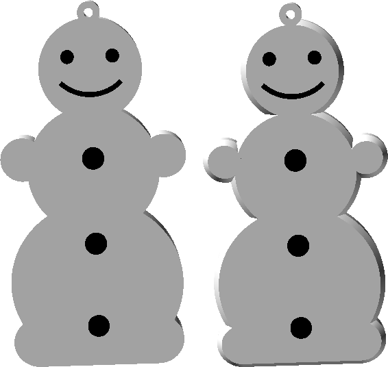

Shield: [![CC BY-SA 4.0][cc-by-sa-shield]][cc-by-sa]

This work is licensed under a
[Creative Commons Attribution-ShareAlike 4.0 International License][cc-by-sa].

[![CC BY-SA 4.0][cc-by-sa-image]][cc-by-sa]

[cc-by-sa]: http://creativecommons.org/licenses/by-sa/4.0/
[cc-by-sa-image]: https://licensebuttons.net/l/by-sa/4.0/88x31.png
[cc-by-sa-shield]: https://img.shields.io/badge/License-CC%20BY--SA%204.0-lightgrey.svg

# Flat Snowman/Snow woman 3D Model

    

The 3D model was designed to be produced on a 3D printer. It is easy to print and doesn't require any supports.

⚠️ **In case of any questions** – do not hesitate to contact the author in Telegram group ([see below](#contact-me)) and ask.

## HOWTO
⚠️ Before assembling read the topic to the bottom!

This 3D model is highly customizable. So you can configure it for you needs.

If you do not need any customizations and would only like to have the same **Snowman Christmas tree decoration**  as I have – you can download prerendered STL files: 
 * https://t.me/YarickWorkshop/579 - with chamfers;
 * https://t.me/YarickWorkshop/580 - angular version.

There are the following options to get a colored model:
  * Use a multi-color 3D printer;
  * Print the model and color it manually;
  * Use the Prusa's [Color change](https://help.prusa3d.com/article/color-change_1687) functionality and print. If you have any other slicers, just google, they all probably have a similar option.
  
## Contact me
To follow the progress go to my channels:
  - Telegram: https://t.me/YarickWorkshop/580
  - YouTube: https://www.youtube.com/@yarick-workshop

Yeah, they both are in Russian, but **if you have any questions** – contact me in either Telegram channel (see above) or Mail: techno.man.983@gmail.com. I can communicate in English without any problems. 

⚠️ **Pay attention**: I do not respond to any comments on YouTube (despite I read them). Why? It is a HUGE secret 🙃
